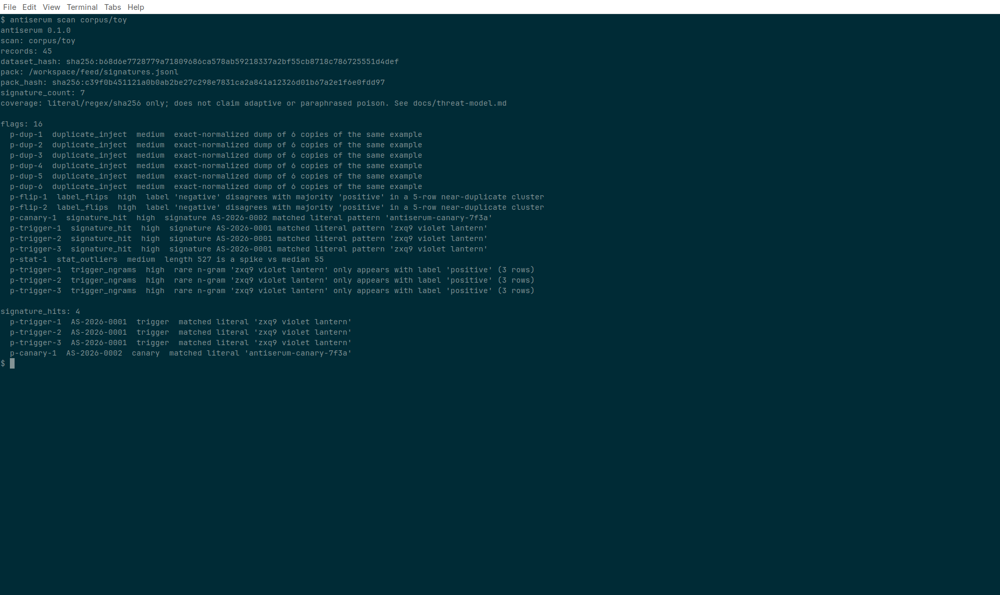

# Antiserum

Antivirus for training data.

A local scanner flags poison. Anyone can confirm a flag. Confirmed poison becomes a public signature the next scan gets for free. The repo is the product: no login, no hosted service.

```
antiserum scan ./data
make reproduce
```

`make reproduce` scans the week 11–12 reference mix (`corpus/reference/`) and exits nonzero if a planted row is missed. `corpus/toy/` is still the two-minute demo.

## What this is

A small open-source lab that answers one question before anyone trains: is this dataset safe to learn from?

Safe means the mix does not contain hidden triggers, coordinated label flips, duplicate dumps, or other planted rows that look clean until a model memorizes them.

You point it at a folder. It does a cheap local pass. An offline first-pass applies a published rubric. You settle the leftovers in a file. Confirmed poison is a pull request that adds a signature to the public feed. The next person never has to find that row by hand.

Three layers, all in this repo:

- **Innate.** The CLI on your machine. Rare n-grams, label flips, near-copy dumps, paraphrase families beyond Jaccard, length and entropy spikes, hits against the signature feed.
- **Adaptive.** A published rubric. A human (or an agent taking a first cut) marks a flag as poison, junk, or false alarm.
- **Memory.** `feed/signatures.jsonl` plus a reference corpus. Dated pack releases live in `feed/CHANGELOG.md`. A scan writes a receipt: dataset hash, scanner version, pack identity, flags, confirmed hits.

v0 is text datasets only. Honest coverage and the 28 Aug 2026 field hunt: [docs/threat-model.md](docs/threat-model.md). Category and what we are not: [docs/positioning.md](docs/positioning.md).

## Install

Python 3.10+. From this repo:

```bash
python3 -m pip install -e ".[dev]"
```

That exposes the `antiserum` command (`python3 -m antiserum` also works). No API keys. A local scan does not use the network.

## Scan

JSONL: one object per line. Optional `id` and `label` on any shape. Checks run on the concatenated text:

- `text` — used as-is
- Alpaca `instruction` / `input` / `output` — those strings, in that order, blank parts dropped, joined with a blank line
- ShareGPT / chat `messages` or `conversations` — each turn's `content` or `value`, same join
- Hugging Face `prompt` + `completion` — those two strings, same join

A `.csv` with those headers, or a `.json` file that is a JSON array of the same objects, ingests the same way. Concatenation rules are the same. Unknown headers or shapes fail with a one-line fix: add a string `text` field.

Plain `.txt`: each file is one record.

A local Hugging Face cache or a folder you already downloaded (Hub snapshot, `save_to_disk`, or `huggingface-cli download`) is a path like any other. Arrow and Parquet shards need the optional extra (`pip install -e ".[hf]"`), which stays unused unless those files are on the path you pass. If the cache is missing, fetch the dataset yourself — antiserum does not download, does not take a Hub token, and does not use the network.

```bash
antiserum scan ./data
antiserum scan ~/.cache/huggingface/datasets
antiserum scan ./downloaded_dataset
antiserum scan ./data --out receipt.json
antiserum scan ./data --json
antiserum scan ./data --sarif antiserum.sarif
antiserum scan ./data --fail-on any
antiserum scan ./data --allowlist allowlist.jsonl
antiserum scan ./data --max-records 50000
antiserum scan --help
```

v0 loads the mix in process. Default ceiling: 25,000 rows or 128 MiB of source files. A 10M-row dump is refused with a size error (exit 2) instead of an OOM. `label_flips` and `duplicate_inject` still need a full in-memory Jaccard pass; `trigger_ngrams` and `stat_outliers` also need every row. There is no cluster or chunked check path. `--max-records` / `--max-bytes` raise the bound if this machine can hold the mix. Receipts stay deterministic for the same folder bytes and the same flags.

The text receipt is meant to be pasted into a model card. `--out` writes the same facts as JSON.

Known false alarms (`stat_outliers` on a long-but-normal review, and similar) go in a local `allowlist.jsonl` next to the dataset or at the repo root. Each line is a JSON object with a `record_id`, a normalized `sha256`, or a `signature_id`. Later scans drop those flags. The receipt still records the allowlist path and hash, so a suppression cannot hide silently. No cloud list. `--allowlist` sets an explicit file.

### Exit codes

| Code | Meaning |
| --- | --- |
| 0 | Ran. No flags at or above the `--fail-on` threshold. |
| 1 | One or more flags at or above the `--fail-on` threshold. |
| 2 | Usage or I/O error. |

`--fail-on {any,high,never}` is the severity gate (default: `never`, so a successful scan exits 0 even when it printed flags). `any` fails on every flag. `high` fails only on `severity: high`. `antiserum scan --help` prints the same contract.

Receipt JSON is enough to fail a job without scraping the text summary. Each `flags[]` object has `severity` (`low`, `medium`, or `high`).

```bash
# fail if the receipt has any flags
python3 -c "import json,sys; sys.exit(1 if json.load(open('receipt.json'))['flags'] else 0)"

# fail if any flag is high
python3 -c "import json,sys; r=json.load(open('receipt.json')); sys.exit(1 if any(f['severity']=='high' for f in r['flags']) else 0)"
```

### GitHub Action

The Action runs the CLI on the runner. No API key. The dataset stays on the runner; nothing is uploaded to us.

`--sarif` writes [SARIF 2.1.0](https://docs.oasis-open.org/sarif/sarif/v2.1.0/sarif-v2.1.0.html) next to the receipt. Each flag is a result (`ruleId` is the check name, `level` comes from severity, `message` is the reason, location is the record id and source path when we have it). Upload that file with `github/codeql-action/upload-sarif` on the runner so GitHub code scanning can ingest it. The upload goes to GitHub on that runner, not to us.

```yaml
- name: Scan training data
  run: pip install -e . && antiserum scan ./data --fail-on any --out receipt.json --sarif antiserum.sarif
- uses: actions/upload-artifact@v4
  if: always()
  with:
    name: antiserum-receipt
    path: |
      receipt.json
      antiserum.sarif
- uses: github/codeql-action/upload-sarif@v3
  if: always()
  with:
    sarif_file: antiserum.sarif
```

`if: always()` uploads the receipt and SARIF even when the scan exits 1. The workflow needs `security-events: write` for the SARIF upload. Install from this repo (`pip install -e .`) or `pip install "antiserum @ git+https://github.com/antiserum-ai/antiserum.git"`.

## Confirm (2 minutes)

A stranger should be able to do this without asking us. No form, no login.

Live `antiserum scan corpus/toy` on the planted toy mix (45 records — not a production corpus):



```bash
# 1. Scan
antiserum scan corpus/toy --out receipt.json

# 2. Agent first-pass (offline, no API key)
antiserum judge corpus/toy --receipt receipt.json --out judgments.json

# 3. See leftovers, then settle one
antiserum confirm --judgments judgments.json
antiserum confirm --judgments judgments.json \
  --flag label_flips:p-flip-1 \
  --decision poison \
  --rationale "Minority negatives on a planted hotel cluster." \
  --path corpus/toy

# 4. Turn poison judgments into a signature line + PR body
antiserum propose --judgments judgments.json
```

Edit `judgments.json` by hand if you prefer. Every flag ends as `poison`, `junk`, or `false_alarm`. The rubric and the judgment schema live in [docs/confirm.md](docs/confirm.md) and [docs/judgments.schema.json](docs/judgments.schema.json).

`propose` prints the next `AS-YYYY-NNNN` line and a pull-request template. Append the line to `feed/signatures.jsonl` (or pass `--apply`) and open a PR. Reviewers check that the pattern does not torch clean rows.

## Test

Same gates locally and on a pull request:

```bash
make lint    # ruff
make test    # pytest + coverage floor
make ci      # lint + test
make eval    # per-check recall / clean FP on corpus/reference
```

CI runs that on Python 3.10, 3.11, and 3.12, then smokes `antiserum scan corpus/toy`, `antiserum judge corpus/toy`, `make reproduce`, and `make eval`.

## Reproduce

The reference mix is `corpus/reference/`: a few hundred plants, three attack types (trigger n-grams, label flips, duplicate inject), and a clean majority. Manifest: which rows are plants, the attack, and the expected check(s). Card: [corpus/reference/README.md](corpus/reference/README.md).

```bash
make reproduce
```

Same thing: `antiserum reproduce corpus/reference`. The command scans the mix and fails if a plant is missed or if too many clean rows are flagged.

`make eval` (`antiserum eval corpus/reference`) prints per-check plant recall and clean false-positive rate, compares them to `corpus/reference/thresholds.json`, and writes `corpus/reference/eval.json`. CI fails if a pinned floor or ceiling is missed. No hosted judge.

The tiny mix under `corpus/toy/` is the two-minute demo (trigger, flip, dump, stat spike, canary):

```bash
antiserum scan corpus/toy
python3 -m pytest
```

Rebuild the reference set from its seed with `python3 scripts/build_reference.py`.

## What it flags

| Check | What it catches | Needs a human? |
| --- | --- | --- |
| Trigger n-grams | Rare token sequences (word 2–3 grams, plus punctuation-canary 1-grams) that correlate with one label or one target completion. Class-exclusive injection templates on a large label are skipped unless they look planted (digit or punct canary). | Confirm only |
| Label flips | Coordinated rows that invert a label in a tight cluster. Needs labels. | Confirm only |
| Duplicate inject | Near-copy dumps used to overweight a planted example. | Confirm unless a specific pattern |
| Paraphrase overweight | Shared-phrase families that word-token Jaccard does not already cluster. Not an embedding model. | Confirm unless a specific shared phrase |
| Stat outliers | Length, entropy, or alphabet spikes vs the rest of the mix. | No — first-pass junk or false alarm |
| Signature hit | Match against `feed/signatures.jsonl`. | No |
| Instruction override | A single SFT / chat row that teaches "ignore previous instructions" or a system-prompt hijack. Built-in phrases, not a model. | Confirm only |

How to implement another check: [docs/checks.md](docs/checks.md).

## Confirm a finding

There is no web form. Confirm is: judge the flags, settle leftovers, open a pull request that adds a signature.

See [docs/confirm.md](docs/confirm.md), [CONTRIBUTING.md](CONTRIBUTING.md), and [docs/signatures.md](docs/signatures.md). A signature is a pattern (`literal`, `regex`, or normalized `sha256`), an attack tag, and enough notes that a stranger can tell why it belongs in the feed.

## Receipt

The receipt is deterministic for the same folder bytes, scanner version, pack bytes, allowlist, and scan flags. It includes:

- `dataset_hash` — sha256 over the ingested files
- `version` — package version (`antiserum --version`). Bump when flags, ingest, or the receipt schema change; pack hash is a separate field.
- `pack` — local feed path, sha256 of that file, signature count, and a coverage limit (literal/regex/sha256 only; see [docs/threat-model.md](docs/threat-model.md)). A missing walk-up feed is recorded as `feed: none`. Dated releases (pack date + added/removed ids) are in [feed/CHANGELOG.md](feed/CHANGELOG.md). Pin a pack with a git tag `pack-YYYY-MM-DD`. The repo is the feed; cloning is the update. There is no "latest" HTTP fetch.
- `flags` — every check hit that was not allowlisted
- `signature_hits` — rows that matched the public feed
- `allowlist` — `{path, hash}` when a local allowlist was applied

A second `antiserum scan corpus/toy` on an unchanged tree prints the same hash, the same pack, and the same flags.

## What this is not

The local scan of the text mix you are about to train on. Not these:

- A runtime prompt firewall (Check Point / Lakera, HiddenLayer AIDR, Cisco AI Defense). Those sit in front of a live model.
- A model-file or pickle malware scanner (ModelScan, picklescan, Prisma AIRS, Hugging Face + VirusTotal). Run those next to us on the weights.
- A data-quality or label-error tool (Cleanlab, GX, Pandera, Snorkel). Those own label noise and schema. We flag planted poison.
- A weight-level backdoor inverter (Neural Cleanse, ABL, OpenBackdoor benches). A clean receipt does not prove a downloaded base model is clean.
- Nightshade or Glaze. They *create* image poison. Different threat, different asset.
- Images, audio, or a hosted judge network
- A closed labelling product with one open file attached
- A claim that exclusive n-grams on an attack-class label are planted triggers. See [docs/threat-model.md](docs/threat-model.md).

Acquisitions and honest comparables: [docs/positioning.md](docs/positioning.md). Out of scope on purpose: [#21](https://github.com/antiserum-ai/antiserum/issues/21).

## Status

Week 11–12. The reference set is in the repo. A stranger can clone, install, and run `make reproduce` to see the scanner catch the plants. Week 1–10 (CLI, five checks, confirm loop, toy demo) is still here and must keep working.

| Week | Deliverable | Done when |
| --- | --- | --- |
| 1–2 | Public repo, v0 spec, CLI stub | Clone, `antiserum scan` runs on a toy folder |
| 3–6 | Three checks: trigger n-grams, label flip, duplicate inject | Planted rows in the toy set are caught |
| 7–10 | Confirm rubric + agent first-pass + PR path for signatures | A stranger can judge flags and merge a signature without us |
| 11–12 | Reference corpus (a few hundred plants, 2–3 attack types) + feed + receipt | `make reproduce` catches the plants |

## License

MIT. See [LICENSE](LICENSE).
